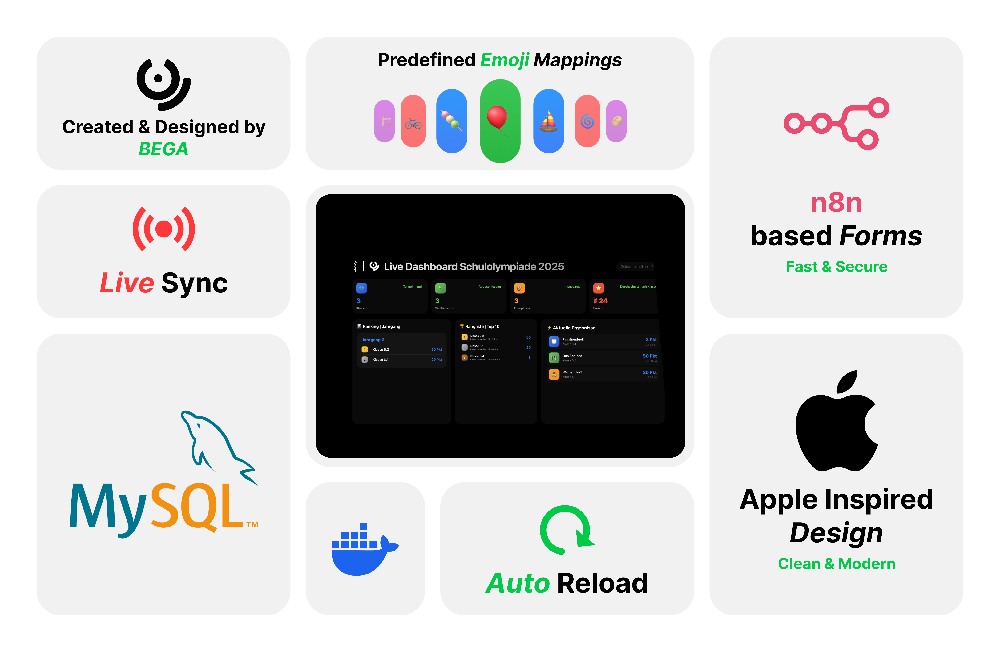

# 🏆 Schulolympiade Dashboard 2026



Ein vollständiges Dashboard- und Verwaltungssystem für die Schulolympiade des Otto-Nagel-Gymnasiums. Docker-basierte Microservice-Architektur mit Live-Ranglisten, Event-Verwaltung und automatisierter Workflow-Integration.

---

## 📑 Inhaltsverzeichnis

- [Features](#-features)
- [Quick Start](#-quick-start)
- [Architektur](#-architektur)
- [Projektstruktur](#-projektstruktur)
- [Konfiguration](#%EF%B8%8F-konfiguration-env)
- [Services](#-services)
- [API-Dokumentation](#-api-dokumentation)
- [Nginx-Routen](#-urls-via-nginx)
- [Disziplinen & Emojis](#-disziplinen--emojis)
- [Scripts](#-scripts)
- [Deployment](#-deployment-auf-neuem-server)
- [n8n Workflows](#-n8n-workflows)
- [Datenbank](#-datenbank)
- [Backups](#-backups)
- [Entwicklung](#%EF%B8%8F-entwicklung)
- [Troubleshooting](#-troubleshooting)
- [Lizenz](#-lizenz)

---

## ✨ Features

- **📊 Live-Dashboard** - Echtzeit-Ranglisten und Statistiken für alle Teams
- **🏅 Team-Leaderboard** - Automatische Punkteberechnung und Platzierungen
- **📝 Ergebnis-Verwaltung** - Admin-Panel zum Bearbeiten von Resultaten
- **🔄 Workflow-Automatisierung** - n8n Integration für Event-Eingabe per Formular
- **📍 IP-Logging** - Nachverfolgung der Formular-Zugriffe
- **💾 Auto-Backups** - Automatische MySQL-Sicherung alle 10 Minuten
- **🐳 Docker-basiert** - Einfaches Deployment mit Docker Compose
- **🔐 Authentifizierung** - Admin-Bereich mit Login-Schutz
- **📱 Responsive** - Funktioniert auf Desktop und Mobilgeräten

---

## 🚀 Quick Start

### Voraussetzungen

- Docker & Docker Compose (v2.0+)
- Git
- Mindestens 2GB RAM für alle Container

### Installation

```bash
# 1. Repository klonen
git clone <repository-url>
cd Schulolympiade-2026

# 2. Konfiguration erstellen
cp .env.example .env

# 3. .env bearbeiten und Werte anpassen
nano .env  # Wichtig: SERVER_HOST, Passwörter ändern!

# 4. Deployment starten
./scripts/deploy.sh --build
```

Nach dem Start sind die Services unter den konfigurierten Ports erreichbar (siehe [Services](#-services)).

---

## 🏗️ Architektur

```
┌─────────────────────────────────────────────────────────────────────────┐
│                              NGINX (Port 80)                            │
│                            Reverse Proxy                                │
└──────────┬─────────────┬──────────────┬─────────────┬──────────────────┘
           │             │              │             │
           ▼             ▼              ▼             ▼
    ┌──────────┐  ┌────────────┐  ┌──────────┐  ┌──────────┐
    │Dashboard │  │ Edit-Data  │  │IP-Logging│  │   n8n    │
    │  :3000   │  │   :3003    │  │  :3005   │  │  :5678   │
    └────┬─────┘  └─────┬──────┘  └──────────┘  └────┬─────┘
         │              │                            │
         ▼              ▼                            ▼
    ┌─────────────────────────────────────────────────────┐
    │                    MySQL :3306                       │
    │              (extern: :3308)                         │
    └─────────────────────────────────────────────────────┘
                              │
                              ▼
    ┌─────────────────────────────────────────────────────┐
    │              PostgreSQL :5432                        │
    │            (n8n Workflow-Daten)                      │
    └─────────────────────────────────────────────────────┘
```

### Datenfluss

1. **Ergebnis-Eingabe**: Nutzer → `/ergebnis` → IP-Logging → n8n-Formular → MySQL
2. **Dashboard-Anzeige**: Dashboard → API → MySQL → Live-Rangliste
3. **Admin-Bearbeitung**: Admin → `/edit-ergebnis` → Login → Direkte DB-Manipulation

---

## 📁 Projektstruktur

```
Schulolympiade-2026/
├── docker-compose.yaml          # 🐳 Haupt-Compose für alle Services
├── .env.example                 # 📋 Vorlage für Umgebungsvariablen
├── .env                         # 🔐 Lokale Konfiguration (nicht im Git!)
├── .gitignore                   # Git-Ausschlüsse
├── README.md                    # 📖 Diese Dokumentation
│
├── services/                    # 🖥️ Node.js Microservices
│   ├── dashboard/               # Haupt-Dashboard (Port 3000)
│   │   ├── Dockerfile
│   │   ├── server.js            # Express-Server mit API-Endpunkten
│   │   ├── package.json
│   │   └── public/              # Frontend-Assets
│   │       ├── index.html       # Dashboard-UI
│   │       ├── script.js        # Frontend-Logik
│   │       ├── style.css        # Styling
│   │       ├── assets/          # Bilder, Icons
│   │       └── data/
│   │           └── emojiMap.json # Disziplin → Emoji Mapping
│   │
│   ├── edit-data/               # Admin: Ergebnisse bearbeiten (Port 3003)
│   │   ├── Dockerfile
│   │   ├── server.js            # Express mit Auth-Middleware
│   │   ├── index.html           # Admin-UI
│   │   ├── script.js            # Admin-Frontend-Logik
│   │   └── style.css
│   │
│   ├── success-event/           # Erfolgsseite nach Event-Eintrag (Port 3001)
│   │   ├── Dockerfile
│   │   ├── server.js
│   │   └── public/
│   │
│   ├── ip-logging/              # IP-Logging + Redirect (Port 3005)
│   │   ├── Dockerfile
│   │   ├── server.js            # Logging & Redirect zu n8n
│   │   └── package.json
│   │
│   └── shared/                  # 📦 Gemeinsame Module
│       ├── db.js                # MySQL2 Connection Pool
│       └── package.json
│
├── nginx/                       # 🌐 Reverse Proxy
│   └── conf.d/
│       └── default.conf         # Routing-Konfiguration
│
├── mysql-init/                  # 🗄️ Datenbank-Initialisierung
│   └── init.sql                 # Schema-Definition
│
├── n8n-workflows/               # 🔄 Workflow-Backups
│   └── Add_Event_Schulolympiade_SQL.json
│
├── scripts/                     # 🛠️ Management-Skripte
│   ├── deploy.sh                # Deployment (build/start/stop/logs)
│   ├── build.sh                 # Docker Images bauen
│   ├── export.sh                # Export für anderen Server
│   └── backup.sh                # Manuelles MySQL-Backup
│
├── assets/                      # 🎨 Statische Assets
│   └── images/
│       └── README-Images/       # Bilder für Dokumentation
│
└── data/                        # 💾 Persistente Daten
    └── backups/                 # MySQL-Backups
```

---

## ⚙️ Konfiguration (.env)

Kopiere `.env.example` nach `.env` und passe die Werte an:

### Server-Konfiguration

| Variable | Beschreibung | Default |
|----------|--------------|---------|
| `SERVER_HOST` | IP/Hostname des Servers | `192.168.100.73` |
| `TZ` | Zeitzone | `Europe/Berlin` |

### MySQL-Konfiguration

| Variable | Beschreibung | Default |
|----------|--------------|---------|
| `MYSQL_ROOT_PASSWORD` | MySQL Root Passwort | `ong2025secure` |
| `MYSQL_DATABASE` | Datenbankname | `schulolympiade` |
| `MYSQL_USER` | MySQL Benutzer | `olympiade_user` |
| `MYSQL_PASSWORD` | MySQL Passwort | `olympiade2025` |
| `MYSQL_PORT` | Interner Port | `3306` |
| `MYSQL_EXTERNAL_PORT` | Externer Port | `3308` |

### Admin-Credentials

| Variable | Beschreibung | Default |
|----------|--------------|---------|
| `ADMIN_USER` | Admin Dashboard Benutzer | `DauView25` |
| `ADMIN_PASSWORD` | Admin Dashboard Passwort | `ongOlympiade#2025` |

### n8n-Konfiguration

| Variable | Beschreibung | Default |
|----------|--------------|---------|
| `N8N_PORT` | n8n Web-UI Port | `5678` |
| `N8N_BASIC_AUTH_USER` | n8n Login-User | `admin` |
| `N8N_BASIC_AUTH_PASSWORD` | n8n Login-Passwort | `n8nAdmin2025` |
| `N8N_POSTGRES_USER` | PostgreSQL User für n8n | `n8n` |
| `N8N_POSTGRES_PASSWORD` | PostgreSQL Passwort | `n8nSecure2025` |
| `N8N_POSTGRES_DB` | PostgreSQL Datenbank | `n8n` |
| `N8N_EVENT_WEBHOOK_ID` | Webhook-ID für Formulare | UUID |

### Service-Ports

| Variable | Beschreibung | Default |
|----------|--------------|---------|
| `DASHBOARD_PORT` | Dashboard | `3000` |
| `SUCCESS_EVENT_PORT` | Success Event | `3001` |
| `SUCCESS_EMOJI_PORT` | Success Emoji | `3002` |
| `EDIT_DATA_PORT` | Edit Data Admin | `3003` |
| `IP_LOGGING_PORT` | IP Logging | `3005` |
| `NGINX_PORT` | Nginx Proxy | `80` |
| `PHPMYADMIN_PORT` | phpMyAdmin | `8080` |
| `CLOUDBEAVER_PORT` | CloudBeaver | `8081` |

### Backup-Konfiguration

| Variable | Beschreibung | Default |
|----------|--------------|---------|
| `BACKUP_CRON` | Backup-Intervall (Cron) | `*/10 * * * *` |
| `MAX_BACKUPS` | Anzahl behaltener Backups | `10` |

---

## 🐳 Services

### Übersicht aller Container

| Service | Container | Port (intern:extern) | Beschreibung |
|---------|-----------|---------------------|--------------|
| **Dashboard** | `dashboard` | 3000:3000 | Live-Ranglisten und Statistiken |
| **Success Event** | `success-event` | 3001:3001 | Bestätigungsseite nach Event-Eintrag |
| **Edit Data** | `edit-data` | 3003:3003 | Admin-Panel für Ergebnisse |
| **IP Logging** | `ip-logging` | 3005:3005 | IP-Logging + Redirect zu n8n |
| **n8n** | `n8n` | 5678:5678 | Workflow-Automatisierung |
| **MySQL** | `schulolympiade_mysql` | 3306:3308 | Hauptdatenbank |
| **PostgreSQL** | `n8n_postgres` | 5432 (nur intern) | n8n Metadaten |
| **MySQL Backup** | `mysql_backup` | - | Automatische Backups |
| **Nginx** | `nginx` | 80:80 | Reverse Proxy |
| **phpMyAdmin** | `phpmyadmin` | 80:8080 | Datenbank-GUI |
| **CloudBeaver** | `cloudbeaver` | 8978:8081 | Alternative DB-GUI |

### Service-Details

#### Dashboard (`services/dashboard/`)
- **Technologie**: Node.js + Express
- **Funktion**: Live-Anzeige aller Ergebnisse und Ranglisten
- **Features**:
  - Automatisches Leaderboard mit Punkteberechnung
  - Disziplin-Statistiken
  - Letzte Ergebnisse (Live-Feed)
  - Emoji-Mapping für Disziplinen
- **API-Endpunkte**: Siehe [API-Dokumentation](#-api-dokumentation)

#### Edit Data (`services/edit-data/`)
- **Technologie**: Node.js + Express
- **Funktion**: Admin-Bereich zur Datenverwaltung
- **Authentifizierung**: Token-basiert (SHA256)
- **Features**:
  - Login-geschützter Zugriff
  - CRUD-Operationen auf Ergebnisse
  - Direkte MySQL-Manipulation

#### IP Logging (`services/ip-logging/`)
- **Technologie**: Node.js (native HTTP)
- **Funktion**: Protokolliert IPs und leitet zu n8n weiter
- **Log-Datei**: `/app/logs/ip_log.txt`

#### Success Event (`services/success-event/`)
- **Technologie**: Node.js + Express
- **Funktion**: Zeigt Erfolgsseite nach Formular-Absenden

---

## 📡 API-Dokumentation

### Dashboard API (`/api/...`)

#### `GET /api/stats`
Liefert Gesamtstatistiken.

**Response:**
```json
{
  "totalParticipants": 12,
  "totalEvents": 156,
  "totalDisciplines": 35,
  "lastUpdate": "04.01.2026, 19:08:52"
}
```

#### `GET /api/leaderboard`
Liefert die Rangliste aller Teams.

**Response:**
```json
[
  {
    "name": "Team Alpha",
    "totalPoints": 245,
    "events": 15,
    "avgPlace": 2.3,
    "places": [1, 2, 3, ...],
    "rank": 1
  },
  ...
]
```

#### `GET /api/disciplines`
Liefert Statistiken zu allen Disziplinen.

**Response:**
```json
[
  {
    "name": "Marshmallow Challenge",
    "participants": 8,
    "avgPoints": 12.5,
    "totalEvents": 8
  },
  ...
]
```

#### `GET /api/recent`
Liefert die letzten 10 Ergebnisse.

**Response:**
```json
[
  {
    "team": "Team Alpha",
    "discipline": "Geo-Dart",
    "points": 15,
    "place": 1,
    "time": "14:30:00"
  },
  ...
]
```

#### `GET /api/emoji-map`
Liefert das Disziplin-Emoji-Mapping.

**Response:**
```json
[
  { "emoji": "🍡", "trigger_word": "Marshmallow Challenge" },
  { "emoji": "🎯", "trigger_word": "Geo-Dart" },
  ...
]
```

### Edit Data API (`/api/...`)

#### `POST /api/login`
Admin-Authentifizierung.

**Request:**
```json
{
  "username": "DauView25",
  "password": "ongOlympiade#2025"
}
```

**Response:**
```json
{
  "success": true,
  "token": "abc123..."
}
```

#### `GET /data/results.json`
Alle Ergebnisse (Auth-Token erforderlich).

**Header:** `Authorization: <token>`

#### `POST /api/save`
Speichert alle Ergebnisse (Auth-Token erforderlich).

**Header:** `Authorization: <token>`

**Request Body:** Array aller Ergebnisse

---

## 🔗 URLs (via Nginx)

Nach dem Start über Nginx (Port 80) erreichbar:

| Pfad | Beschreibung | Ziel-Service |
|------|--------------|--------------|
| `/` | Haupt-Dashboard | dashboard:3000 |
| `/dashboard/` | Dashboard (alternative Route) | dashboard:3000 |
| `/ergebnis/` | Ergebnis-Eingabe (mit IP-Logging) | ip-logging:3005 → n8n |
| `/edit-ergebnis/` | Admin: Ergebnisse bearbeiten | edit-data:3003 |
| `/success-event/` | Erfolgsseite | success-event:3001 |
| `/form/*` | n8n Formulare | n8n:5678 |
| `/webhook/*` | n8n Webhooks | n8n:5678 |

### Direkte Service-URLs

| Service | URL |
|---------|-----|
| Dashboard | `http://<SERVER_HOST>:3000` |
| Edit Data | `http://<SERVER_HOST>:3003` |
| n8n | `http://<SERVER_HOST>:5678` |
| phpMyAdmin | `http://<SERVER_HOST>:8080` |
| CloudBeaver | `http://<SERVER_HOST>:8081` |

---

## 🎯 Disziplinen & Emojis

Die Schulolympiade umfasst 35 verschiedene Disziplinen mit zugeordneten Emojis:

| Emoji | Disziplin |
|-------|-----------|
| 🍡 | Marshmallow Challenge |
| 🕵️‍♂️ | Wer ist das? |
| 🏰 | Das Schloss |
| 🔤 | Worttüftelei |
| 🎯 | Geo-Dart |
| 🧱 | Baumeister |
| 🧠 | Merk's dir |
| ❓ | Quiz |
| 🪡 | Knopf annähen |
| 🗓️ | Wann war das doch gleich? |
| 🎶 | Songtitel |
| 🎈 | Luftballon |
| 🚲 | Fahrradrennen |
| 🟰 | Kopfrechnen |
| 🥢 | Chopsticks |
| 🧑‍🧑‍🧒‍🧒 | Familienduell |
| ⚽️ | Lattenknaller |
| 🃏 | Memory |
| 🧩 | Puzzlen |
| 🚶 | Figuren legen |
| 🌀 | Ab durch die Röhre |
| 🦯 | Blinder Hindernislauf |
| 🥚 | Eierlauf |
| 🏉 | Harzer-Rugby |
| 🛏️ | Laken wenden |
| 👀 | Menschenkenntnis |
| ⛷️ | Sommerski |
| 🗂️ | Sortieren |
| 🤫 | Stille Post |
| 🪣 | Wassertransport |
| 🥓 | Wer stiehlt den Speck |
| ♟️ | Wikingerschach |
| ⛵️ | Wir fahren über 'n See |
| 🤔 | Wir schätzen das ONG |
| 🏗️ | Fröbelturm |

Die Emoji-Mappings sind in `services/dashboard/public/data/emojiMap.json` definiert.

---

## 📜 Scripts

Alle Skripte befinden sich im `scripts/` Verzeichnis und müssen ausführbar sein (`chmod +x scripts/*.sh`).

### deploy.sh - Hauptverwaltung

```bash
# Build und Start aller Container
./scripts/deploy.sh --build

# Nur starten (Images müssen existieren)
./scripts/deploy.sh

# Alle Container stoppen
./scripts/deploy.sh --down

# Live-Logs anzeigen
./scripts/deploy.sh --logs

# Status aller Container
./scripts/deploy.sh --status
```

### build.sh - Docker Images

```bash
# Lokal bauen
./scripts/build.sh

# Mit Custom Tag
./scripts/build.sh --tag v1.0.0

# Bauen und zu Registry pushen
./scripts/build.sh --push --registry myregistry.com
```

### export.sh - Deployment-Paket erstellen

```bash
# Erstellt schulolympiade-deploy-YYYYMMDD_HHMMSS.tar.gz
./scripts/export.sh

# In spezifischen Ordner exportieren
./scripts/export.sh /path/to/output
```

### backup.sh - Manuelles Datenbank-Backup

```bash
# Backup in data/backups/
./scripts/backup.sh

# Backup in spezifischen Ordner
./scripts/backup.sh /path/to/backups
```

---

## 🚚 Deployment auf neuem Server

### 1. Export erstellen (Quell-Server)

```bash
./scripts/export.sh
# Erstellt: schulolympiade-deploy-20260104_190852.tar.gz
```

### 2. Transfer zum Ziel-Server

```bash
scp schulolympiade-deploy-*.tar.gz user@newserver:~/
```

### 3. Installation (Ziel-Server)

```bash
# Entpacken
tar -xzf schulolympiade-deploy-*.tar.gz
cd schulolympiade

# Konfiguration
cp .env.example .env
nano .env  # SERVER_HOST, Passwörter anpassen!

# Starten
./scripts/deploy.sh --build
```

### 4. n8n Workflows importieren

Siehe [n8n Workflows](#-n8n-workflows).

---

## 🔄 n8n Workflows

n8n ist die Workflow-Automatisierungs-Plattform für die Ergebnis-Eingabe.

### Setup nach erstem Start

1. **n8n öffnen**: `http://<SERVER_HOST>:5678`

2. **Login** mit Credentials aus `.env`:
   - User: `N8N_BASIC_AUTH_USER`
   - Password: `N8N_BASIC_AUTH_PASSWORD`

3. **Workflow importieren**:
   - Menü → Import from File
   - Datei: `n8n-workflows/Add_Event_Schulolympiade_SQL.json`

4. **MySQL Credentials konfigurieren**:
   - Settings → Credentials → Add Credential → MySQL
   - **Host**: `mysql` (Docker-interner Hostname!)
   - **Port**: `3306`
   - **Database**: aus `.env` (`MYSQL_DATABASE`)
   - **User**: aus `.env` (`MYSQL_USER`)
   - **Password**: aus `.env` (`MYSQL_PASSWORD`)

5. **Webhook-URL aktualisieren** (falls nötig):
   - Webhook-ID in Workflow notieren
   - In `.env` die `N8N_EVENT_WEBHOOK_ID` entsprechend setzen

6. **Workflow aktivieren** (Toggle oben rechts)

### Workflow-Funktion

Der "Add Event" Workflow:
1. Empfängt Formular-Daten via Webhook
2. Validiert die Eingaben
3. Speichert in MySQL (`results` Tabelle)
4. Leitet zur Success-Seite weiter

---

## 🗄️ Datenbank

### Schema

```sql
CREATE TABLE results (
    id INT AUTO_INCREMENT PRIMARY KEY,
    team VARCHAR(100) NOT NULL,
    disziplin VARCHAR(200) NOT NULL,
    punkte INT NOT NULL,
    platz INT NOT NULL,
    uhr TIME NOT NULL,
    created_at TIMESTAMP DEFAULT CURRENT_TIMESTAMP,
    updated_at TIMESTAMP DEFAULT CURRENT_TIMESTAMP ON UPDATE CURRENT_TIMESTAMP,
    INDEX idx_team (team),
    INDEX idx_disziplin (disziplin),
    INDEX idx_uhr (uhr)
);
```

### Verbindungsdaten (innerhalb Docker)

| Parameter | Wert |
|-----------|------|
| Host | `mysql` |
| Port | `3306` |
| Database | `schulolympiade` |
| User | aus `.env` |
| Password | aus `.env` |

### Verbindungsdaten (extern)

| Parameter | Wert |
|-----------|------|
| Host | `<SERVER_HOST>` |
| Port | `3308` (oder `MYSQL_EXTERNAL_PORT`) |
| Database | `schulolympiade` |
| User | aus `.env` |
| Password | aus `.env` |

### Datenbank-GUIs

- **phpMyAdmin**: `http://<SERVER_HOST>:8080`
- **CloudBeaver**: `http://<SERVER_HOST>:8081`

---

## 💾 Backups

### Automatische Backups

Der `mysql_backup` Container erstellt automatisch Backups:

- **Intervall**: Alle 10 Minuten (konfigurierbar via `BACKUP_CRON`)
- **Speicherort**: `data/backups/`
- **Aufbewahrung**: Letzte 10 Backups (konfigurierbar via `MAX_BACKUPS`)
- **Format**: Komprimierte SQL-Dumps (`.sql.gz`)

### Manuelles Backup

```bash
./scripts/backup.sh
# Erstellt: data/backups/schulolympiade_20260104_190852.sql.gz
```

### Backup wiederherstellen

```bash
# In Container kopieren und wiederherstellen
gunzip -c data/backups/schulolympiade_TIMESTAMP.sql.gz | \
  docker exec -i schulolympiade_mysql mysql -u$MYSQL_USER -p$MYSQL_PASSWORD $MYSQL_DATABASE
```

---

## 🛠️ Entwicklung

### Lokale Entwicklung (ohne Docker)

```bash
# 1. MySQL lokal starten (z.B. via Docker)
docker run -d --name mysql-dev \
  -e MYSQL_ROOT_PASSWORD=root \
  -e MYSQL_DATABASE=schulolympiade \
  -e MYSQL_USER=olympiade_user \
  -e MYSQL_PASSWORD=olympiade2025 \
  -p 3308:3306 mysql:8.0

# 2. Shared Module installieren
cd services/shared
npm install

# 3. Service installieren und starten
cd ../dashboard
npm install

# 4. Umgebungsvariablen setzen
export MYSQL_HOST=localhost
export MYSQL_PORT=3308
export MYSQL_USER=olympiade_user
export MYSQL_PASSWORD=olympiade2025
export MYSQL_DATABASE=schulolympiade

# 5. Starten
npm start
```

### Einzelne Container rebuilden

```bash
# Nur Dashboard neu bauen
docker compose build dashboard
docker compose up -d dashboard
```

### Logs eines Services

```bash
docker compose logs -f dashboard
docker compose logs -f n8n
```

---

## 🔧 Troubleshooting

### Container startet nicht

```bash
# Status prüfen
docker compose ps

# Logs des problematischen Containers
docker compose logs <service-name>

# Neustart
docker compose restart <service-name>
```

### MySQL-Verbindungsfehler

1. Prüfen ob MySQL läuft:
   ```bash
   docker exec schulolympiade_mysql mysqladmin ping -u root -p
   ```

2. Credentials in `.env` prüfen

3. Container-Netzwerk prüfen:
   ```bash
   docker network inspect schulolympiade-2026_olympiade_network
   ```

### n8n Formular funktioniert nicht

1. Workflow aktiviert?
2. MySQL Credentials in n8n korrekt?
3. Webhook-ID in `.env` korrekt?
4. Logs prüfen: `docker compose logs n8n`

### Dashboard zeigt keine Daten

1. MySQL-Container läuft?
2. Daten in Tabelle vorhanden?
   ```bash
   docker exec -it schulolympiade_mysql mysql -u$MYSQL_USER -p$MYSQL_PASSWORD -e "SELECT COUNT(*) FROM schulolympiade.results;"
   ```

### Ports bereits belegt

```bash
# Welcher Prozess nutzt den Port?
sudo lsof -i :3000

# Alternative Ports in .env konfigurieren
```

---

## 📝 Lizenz

**Copyright © 2025-2026 BEGA Team (Otto-Nagel-Gymnasium)**

Diese Software darf ohne ausdrückliche, schriftliche Genehmigung des Autors nicht verwendet, kopiert, verändert, verbreitet oder weitergegeben werden.

---

<div align="center">
  <sub>Entwickelt mit ❤️ für das Otto-Nagel-Gymnasium</sub>
</div>
